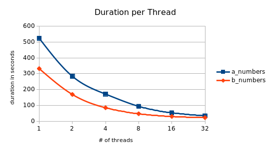
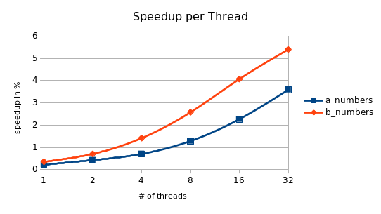

# Parallel Processing
My take on the parallel-processing project tasks for Kassel university.

## Part I
This part focuses on [OpenMP](https://www.openmp.org/).

### a_numbers
[a_numbers.c](a_numbers.c) calculates hits with a value that affects a value spread on a matrix.

| average duration | value (s) | speedup |
|------|-------|---------|
|sequential|120.55||
|parallel, 1 thread|523.79|0.23|
|parallel, 2 threads|283.32|0.43|
|parallel, 4 threads|170.96|0.71|
|parallel, 8 threads|93.58|1.29|
|parallel, 16 threads|53.06|2.27|
|parallel, 32 threads|33.62|3.59|

The sequential duration was measured 18 times, each parallel duration 3 times with `n = 20000, R = 900, init_rand = 123`.

### b_numbers
[b_numbers](b_numbers.c) does the same as a_numbers, but optimized for [NUMA](https://en.wikipedia.org/wiki/Non-uniform_memory_access).

| average duration | value (s) | speedup |
|------|-------|---------|
|sequential|120.43||
|parallel, 1 thread|331.92|0.36|
|parallel, 2 threads|168.53|0.71|
|parallel, 4 threads|84.81|1.42|
|parallel, 8 threads|46.66|2.58|
|parallel, 16 threads|29.58|4.07|
|parallel, 32 threads|22.29|5.40|

The durations were measured as in [a_numbers](#a_numbers).

### c_perfect
[c_perfect](c_perfect.c) calculates primes and outputs [perfect numbers](https://en.wikipedia.org/wiki/Perfect_number) with tolerance, optionally using the generated primes.

|prime number usage|highest almost perfect number after 30s|
|------------------|---------------------------------------|
|without|8394752|
|with||

#### Diagrams

