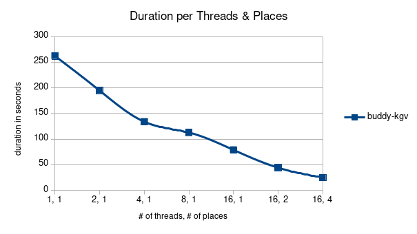

# Part II - APGAS
This part focuses on [APGAS](https://github.com/x10-lang/apgas).

## BuddyLcm
[BuddyLcm.java](src/groupP/BuddyLcm.java) searches a "buddy" for each element in a matrix in another matrix. A buddy is an element if the least common multiple of both values is larger than a threshold.

### n = 2048

|average duration              |value (s)  |speedup  |
|------------------------------|-----------|---------|
|sequential                    |1.84       |         |
|parallel, 1 thread, 1 place   |5.21       |0.35     |
|parallel, 2 threads, 1 place  |4.70       |0.39     |
|parallel, 4 threads, 1 place  |3.25       |0.57     |
|parallel, 8 threads, 1 place  |3.40       |0.54     |
|parallel, 16 threads, 1 place |4.16       |0.44     |
|parallel, 16 threads, 2 places|4.35       |0.42     |
|parallel, 16 threads, 4 places|4.18       |0.44     |

It is clear to see that with such a small value for `n` there is a predominant overhead.

### n = 16384

|average duration              |value (s)    |speedup  |
|------------------------------|-------------|---------|
|sequential                    |Out of memory|         |
|parallel, 1 thread, 1 place   |262.21       |         |
|parallel, 2 threads, 1 place  |194.67       |         |
|parallel, 4 threads, 1 place  |133.81       |         |
|parallel, 8 threads, 1 place  |112.75       |         |
|parallel, 16 threads, 1 place |78.78        |         |
|parallel, 16 threads, 2 places|44.04        |         |
|parallel, 16 threads, 4 places|24.76        |         |

Each duration was measured 3 times on the [exec partition of the ITS cluster](https://www.uni-kassel.de/its-handbuch/en/daten-dienste/wissenschaftliche-datenverarbeitung/access-and-use-of-the-cluster/partitionen.html) with `m=10000, seedA=123, seedB=456, minLcm=50000, verbose=false`.

### Diagrams

### Feedback
The `asyncAt` calls in BuddyLcm.java#L182-L185 could've been merged into a single one to reduce the amount of individual network traffic creation.
Also, for some thread numbers the output is incorrect.
This is most likely owed to the fact that the second matrix is also divided between places, but it logically shouldn't.
